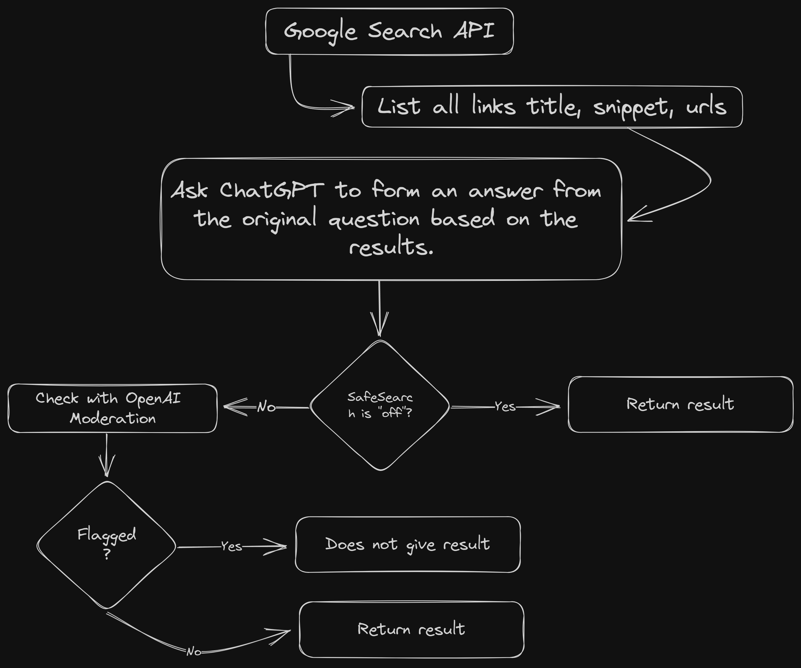

# Beyond2021

Beyond2021 is a package to get data from the web. It uses Google Search API and OpenAI API to get data from the web.

### Installation:

Use PNPM or PNPM and install the pacakges `pnpm install` or `npm install`

### Setup

Set the required environment variables 
```ts
export const web = new DataBeyond({
  GOOGLE_SEARCH_API_KEY: "",
  GOOGLE_SEARCH_ENGINE_ID: "",
  OPENAI_API_KEY: "",
  OPENAI_ORGANIZATION_ID: "", // Optional
  MULTIPLE_SEARCH_API_KEYS: [], // Optional (Key table for using a new key if it is rate-limited)
});
```

### Usage

```ts
const dataWebSearch = await websearch.search("What is the best way to learn programming?");

const url = dataWebSearch.url ?? "No url found";
const content = dataWebSearch.content;
```

### How it works ?

